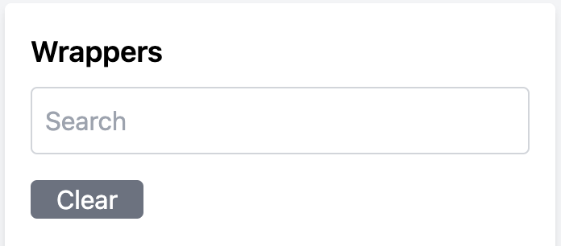
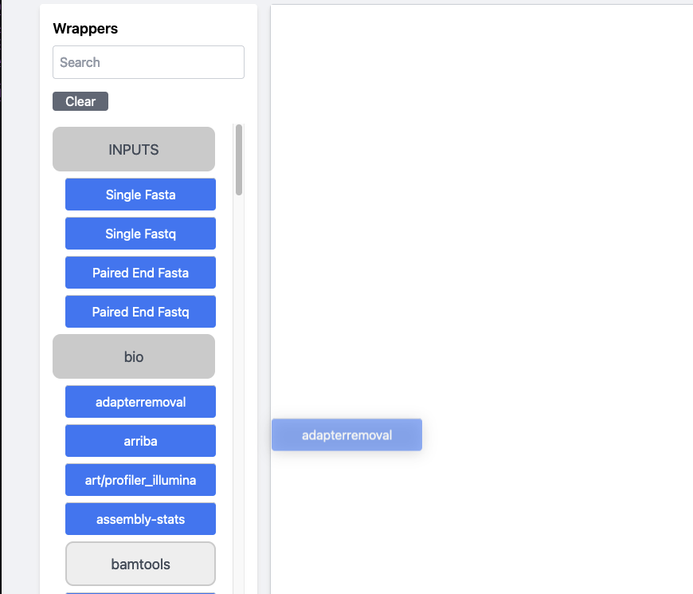
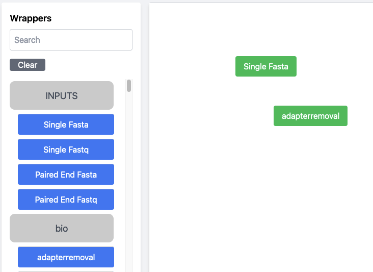
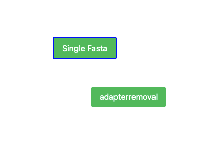
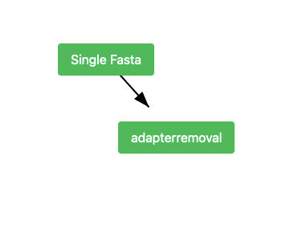
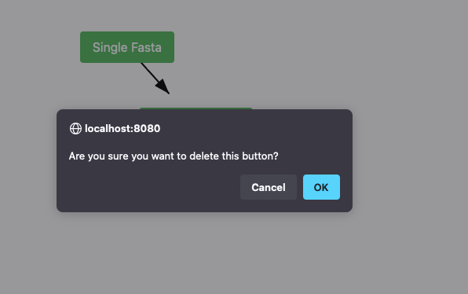
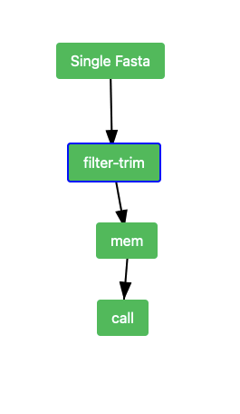
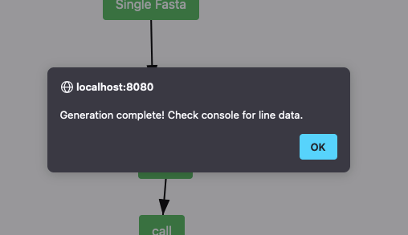

# README


[![Static Badge](https://img.shields.io/badge/Snakemake-Wrappers-%23039475?logo=data:image/svg+xml;base64,PD94bWwgdmVyc2lvbj0iMS4wIiBlbmNvZGluZz0iVVRGLTgiIHN0YW5kYWxvbmU9Im5vIj8+CjwhLS0gQ3JlYXRlZCB3aXRoIElua3NjYXBlIChodHRwOi8vd3d3Lmlua3NjYXBlLm9yZy8pIC0tPgoKPHN2ZwogICB3aWR0aD0iMjMuNjQ5OTQ0bW0iCiAgIGhlaWdodD0iMjMuNjUyNzM5bW0iCiAgIHZpZXdCb3g9IjAgMCAyMy42NDk5NDQgMjMuNjUyNzM5IgogICB2ZXJzaW9uPSIxLjEiCiAgIGlkPSJzdmcxIgogICB4bWw6c3BhY2U9InByZXNlcnZlIgogICB4bWxuczp4bGluaz0iaHR0cDovL3d3dy53My5vcmcvMTk5OS94bGluayIKICAgeG1sbnM9Imh0dHA6Ly93d3cudzMub3JnLzIwMDAvc3ZnIgogICB4bWxuczpzdmc9Imh0dHA6Ly93d3cudzMub3JnLzIwMDAvc3ZnIj48ZGVmcwogICAgIGlkPSJkZWZzMSI+PGNvbG9yLXByb2ZpbGUKICAgICAgIG5hbWU9IkRpc3BsYXkiCiAgICAgICB4bGluazpocmVmPSJmaWxlOi8vL0xpYnJhcnkvQ29sb3JTeW5jL1Byb2ZpbGVzL0Rpc3BsYXlzLy0xMUI3M0RDNy0wMDhFLTQ0MUUtQjQ4Mi02MTk3MkVENTQ5MzAuaWNjIgogICAgICAgaWQ9ImNvbG9yLXByb2ZpbGUxIiAvPjxjb2xvci1wcm9maWxlCiAgICAgICBuYW1lPSJBQ0VTLUNHLUxpbmVhci1BY2FkZW15LUNvbG9yLUVuY29kaW5nLVN5c3RlbS1BUDEiCiAgICAgICB4bGluazpocmVmPSJmaWxlOi8vL1N5c3RlbS9MaWJyYXJ5L0NvbG9yU3luYy9Qcm9maWxlcy9BQ0VTQ0clMjBMaW5lYXIuaWNjIgogICAgICAgaWQ9ImNvbG9yLXByb2ZpbGUyIiAvPjwvZGVmcz48ZwogICAgIGlkPSJsYXllcjEiCiAgICAgdHJhbnNmb3JtPSJ0cmFuc2xhdGUoLTEwOS45MDcyMywtMTMxLjQ2NjUxKSI+PHBhdGgKICAgICAgIHN0eWxlPSJmaWxsOiMwMzk0NzU7ZmlsbC1vcGFjaXR5OjEiCiAgICAgICBkPSJtIDExNS41Mzg5MSwxNTQuODg4NzEgYyAtMy41NzMwNiwtMC43NzczNiAtNi41NTcwMiwtNC45OTY3NSAtNC40NDQ2LC02LjI4NDc4IDAuNTMzMTcsLTAuMzI1MDkgMTQuNzg4OTEsLTAuNDUzNjEgMTUuOTAzODcsLTAuMTQzMzcgMi44Mzc4OCwwLjc4OTYzIDMuMDk1MzYsNS4xMzQ1IDAuMzc3NDMsNi4zNjkwMiAtMC43NzE4MiwwLjM1MDU3IC0xMC4yNzg4MiwwLjM5ODA2IC0xMS44MzY3LDAuMDU5MSB6IG0gMTUuMjcyNTksLTMuMTUyMTIgYyAtMC4xOTQyNywtNC4wNjMyNiAtMS43ODYzLC00LjkyNTgzIC05LjMwMTkxLC01LjAzOTg1IC01LjI2NzA4LC0wLjA3OTkgLTUuMjY3MDgsLTAuMDc5OSAtNS45MDQ3OSwtMC41Mjg0MSAtMi4wOTM5OSwtMS40NzI3MyAtMi4wMjU2MywtNC41MTU1MiAwLjEyOTksLTUuNzgyNTcgMC45OTk3MywtMC41ODc2NiAxMS4yODYwMiwtMC42NTA2MyAxMi44MDIxNCwtMC4wNzg0IDQuOTI1MjEsMS44NTg5OCA2LjY1ODc4LDguMzYxOTUgMy4yMzg0LDEyLjE0NzkgLTAuNzg2MTMsMC44NzAxNiAtMC44OTE1NCwwLjc5MTU2IC0wLjk2Mzc0LC0wLjcxODY5IHogbSAtMTkuMzA3NzcsLTcuODkzMzYgYyAtMy4xNjA2OSwtNC4xODYyOSAtMS40MzQ2NywtMTAuMTI3NjQgMy40NzA5MSwtMTEuOTQ3NjcgMS4xODg3MSwtMC40NDEwMiAxMC43MzczMywtMC41OTY0NCAxMi42MTQyNCwtMC4yMDUzMSAzLjMwNDgyLDAuNjg4NjggNi4yMzEyNiwzLjkzMjQ2IDUuMjUzNTIsNS44MjMxOSAtMC4zODkyNywwLjc1Mjc2IC0wLjQ2MzY2LDAuNzU5NzkgLTguMDM5MTYsMC43NTk3OSAtOC43MzM1MSwwIC05LjAyNjE2LDAuMDQzNCAtMTAuNjcxOTEsMS41ODI4MSAtMS4wMzQ1OSwwLjk2Nzc0IC0xLjQ5NzI0LDIuMDAzODcgLTEuNTc3NSwzLjUzMjg5IC0wLjA3ODMsMS40OTE4MSAtMC4yMjAzNywxLjU1MzI3IC0xLjA1MDEsMC40NTQzIHogbSAxNi41MDM2MiwtOC43NTkxOCBjIDAuNDY5ODgsLTAuMzI5MTIgMC4zOTIxNywtMS4wNzYzOSAtMC4xNDMwMiwtMS4zNzUzMyAtMC44NjIwNCwtMC40ODE1MSAtMS42NDM0NiwwLjgxMzY3IC0wLjgzMzI5LDEuMzgxMTQgMC40MTIzLDAuMjg4NzggMC41NTY5NCwwLjI4NzkyIDAuOTc2MzEsLTAuMDA2IHoiCiAgICAgICBpZD0icGF0aDEiIC8+PC9nPjwvc3ZnPgo=)](https://snakemake.readthedocs.io/en/stable/)


## Help

### How to search



Names of tools can be typed into the search bar and the list of wrappers will
filter and display all matching tools. The search bar can be cleared by deleting
the text or by pressing the clear button.

### How to place tools

Once the wrapper list on the left is expanded and tool in blue can be dragged
to the left onto the canvas.



Once the tools has been dragged to the canvas it will turn green.



### How to connect tools

To connect the tools you click on the 'first button' and will see a blue
outline around the button.



Then you click on the second tool and an arrow will be drawn from `button1` to
`button2`.



### How to remove tools/ connections

To remove tools or connections you simply double click on of the green buttons
and an alert will apear to confirm that you want to delete the item.



Once confirmed, the tool button and any lines connected to it will be removed.

### Moveing Items

The whole canvas can be panned by clicking on the white space and dragging it
around.

Individual buttons can also be moved by clicking and dragging them.

### Getting a Snakefile

Before you can generate your Snakefile, you will create a workflow by dragging
buttons onto the canvas.



Then you will click the orange 'Generate' button at the top right of the window.
An alert will pop up telling you that the data has been sent to the server.
At this point the server generates the Snakefile.



## Setup to Run Server

Now using [ngrok](https://ngrok.com/) to serve the webapp. To set up you need to
log into ngrok and export your key to the env. The app can be launched as
follows:

```bash
NGROK_AUTHTOKEN=<TOKEN> go run main.go
```

This will give you a link to view and interact with the webapp.

If this process does not work you may have to set up the env.

```bash
git clone https://github.com/jonathan-bravo/hci_project.git

cd hci_project

go mod init hello-ngrok

go get golang.ngrok.com/ngrok
```

If the `go run` command from above works with your `NGROK_AUTHTOKEN` you can
safely ignore this part.

## Not Yet Supported

- Importing your own snakefile

## Todo

- Make the CSS prettier
- Back-query snakemake wrappers github for wrappers-get
- Add block on top of search and canvas for param input on tools
- Haveing a collapasble Snakefile canvas (like overleaf) that shows the file
  - Snakemake can be downloaded from here if desired